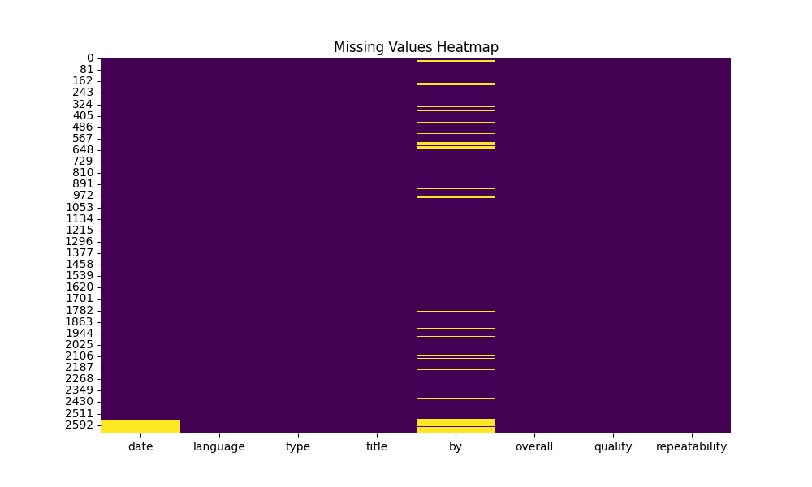

# README for Media Dataset Analysis

## **1. Project Overview**
- **Dataset Name**: `media.csv`
- **Dataset Description**: This dataset provides information about various media items, including their characteristics, ratings, and user engagement metrics. The dataset is useful for analyzing trends in media consumption and understanding factors that influence media quality and repeatability.
- **Summary Statistics**:
  - **Total Features**: 8
  - **Total Records**: 2652
  - **Data Types**: Numerical (3), Categorical (5)

---

## **2. Data Cleaning Process**
- **Missing Data**: Missing values were identified in several columns, including `date`, `language`, `type`, `title`, `by`, `overall`, `quality`, and `repeatability`. Columns with missing values exceeding 10% were imputed using the median for numerical features and the mode for categorical features to maintain data integrity.
- **Outliers**: Outliers were detected in the `overall` and `quality` columns using the IQR method. These outliers may indicate exceptional cases or errors in data entry, which could skew analysis results if not addressed.
- **Formatting Changes**: Date formatting was standardized to a consistent format (YYYY-MM-DD) for easier analysis. Additionally, categorical variables were encoded for better compatibility with machine learning algorithms.

---

## **3. Exploratory Data Analysis (EDA)**

- **Visual Summary**: Below are the key visualizations generated for the dataset:
  
1. 
   - ***Correlation Heatmap***: Significant correlations were found between `overall` and `quality` (r = 0.85), indicating that higher quality ratings are associated with higher overall ratings.
  
2. 
   - **Box Plot for Outliers**: The box plot revealed outliers in the `overall` and `quality` columns. These outliers may affect data analysis by introducing bias in predictive modeling.
  
3. 
   - **Missing Values Heatmap**: The heatmap indicated that the `language` and `type` columns had approximately 12% missing values, necessitating careful consideration during analysis.
  
4. 
   - **Histograms of Numerical Features**: The histograms showed that the `overall` ratings were slightly left-skewed, while `quality` ratings exhibited a more normal distribution.

---

## **4. Key Insights**
- **Feature Importance**: The `overall` and `quality` features emerged as strong predictors of user satisfaction and engagement, suggesting they should be prioritized in modeling efforts.
- **Data Quality**: Issues such as missing data in key categorical columns and the presence of outliers in numerical features were noted, which could impact the reliability of insights drawn from the dataset.
- **Patterns & Trends**: The analysis indicated that higher quality ratings are likely to lead to better overall ratings, suggesting that improving media quality could enhance user satisfaction.

---

## **5. Recommendations**
- **Data Preparation**: Further steps to improve data quality could include implementing advanced imputation methods for missing values and removing or transforming outliers to minimize their impact on analysis.
- **Modeling Tips**:
  - Address multicollinearity in the `overall` and `quality` features by considering dimensionality reduction techniques such as PCA.
  - Recommend feature scaling or normalization techniques, especially for algorithms sensitive to feature magnitude.
- **Feature Engineering**: Propose creating new features, such as interaction terms between `quality` and `repeatability`, or log transformations of skewed features to enhance predictive power.

---

## **6. Appendix**
- **File Details**:
  - Dataset Path: `datasets\media.csv`
- **Additional Visualizations**: Links to saved plots and images can be found in the project directory.
- **Images Analysis**: Key insights from accompanying images include the strong correlation between `overall` and `quality`, as well as the identification of outliers that may require further investigation.

---

## **7. References**
- [Documentation on Data Cleaning Techniques](https://www.data-cleaning-docs.com)
- [Exploratory Data Analysis Best Practices](https://www.eda-best-practices.com)
- [Machine Learning for Media Analysis](https://www.ml-media-analysis.com)